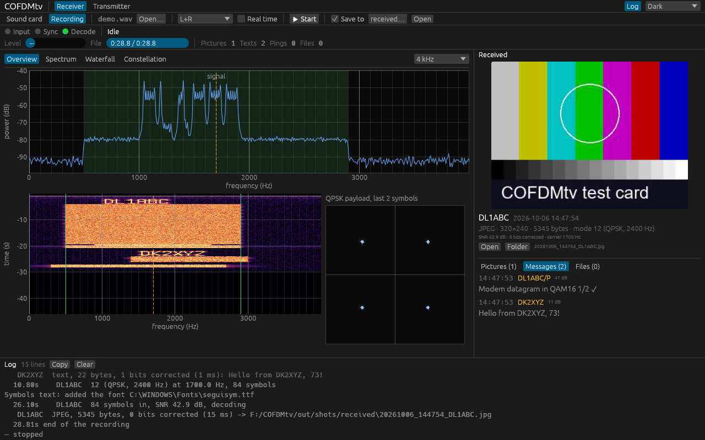
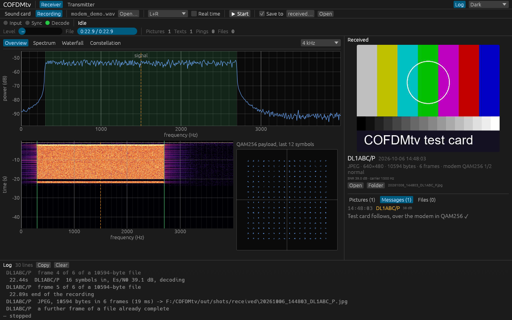
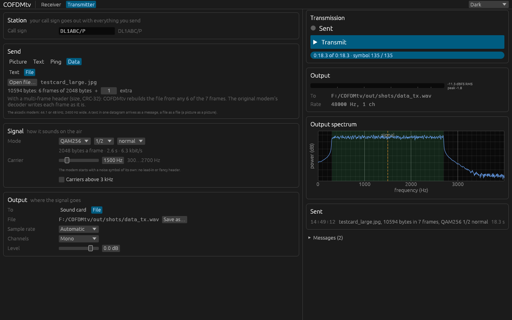
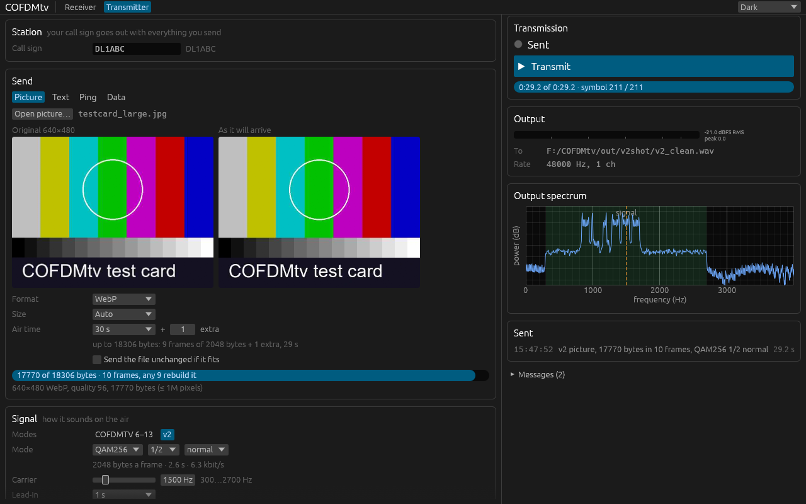
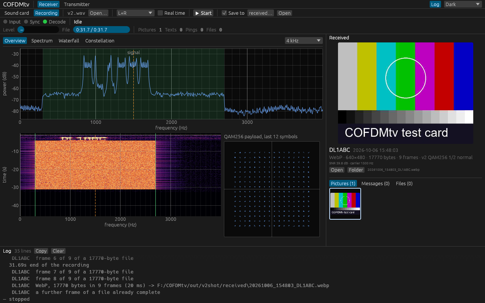
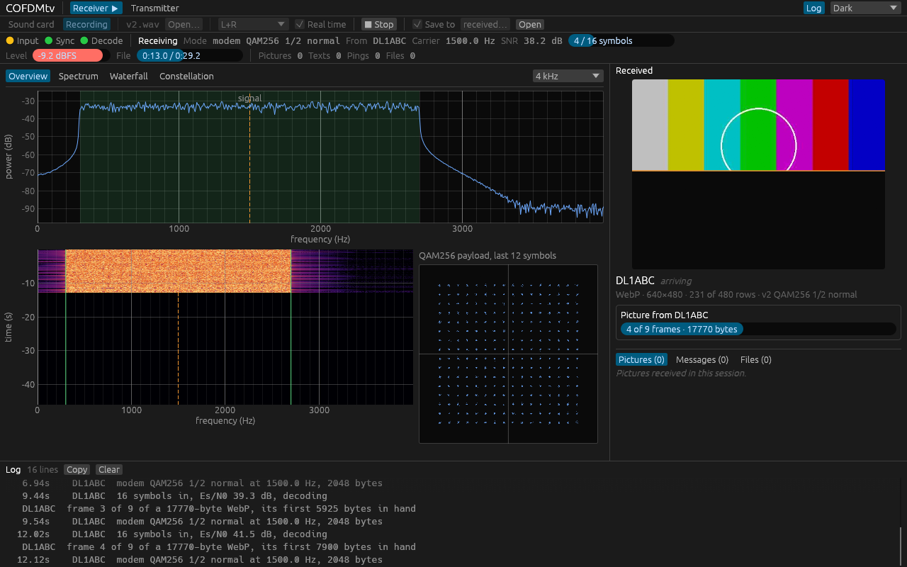
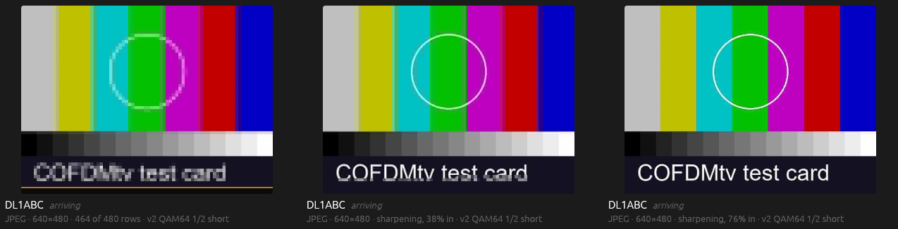
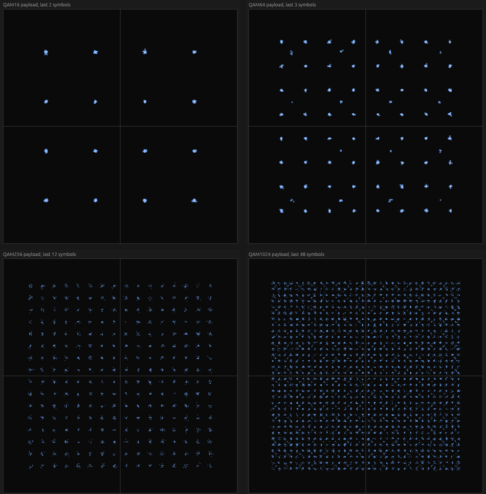
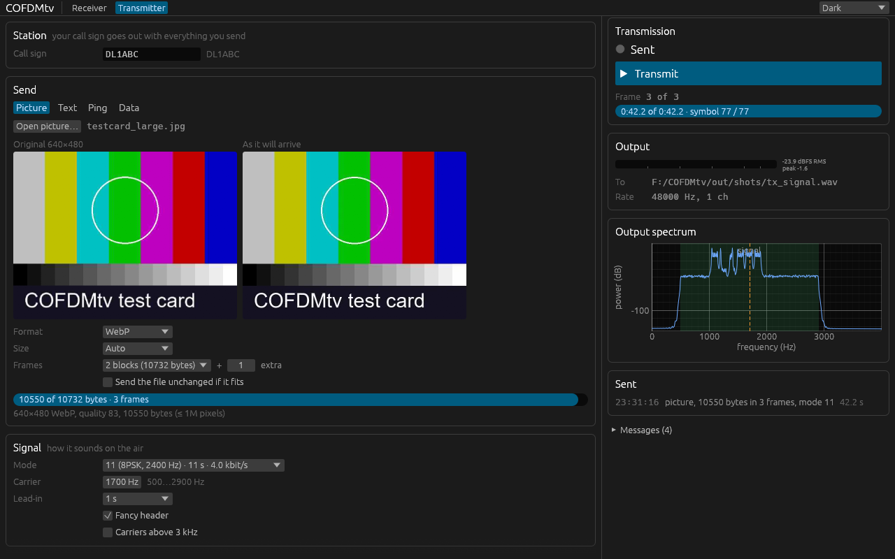

# COFDMtv

A desktop transceiver, in Rust, for the audio modems Ahmet Inan builds at
**[aicodix](https://www.aicodix.de)** ([github.com/aicodix](https://github.com/aicodix)),
with the look of [DecDRM](https://github.com/CasualArclamp/DecDRM). It works with
aicodix's own apps and programs:

- **COFDMTV pictures** — send and receive images like the Android apps
  [Shredpix](https://github.com/aicodix/shredpix) and
  [Assempix](https://github.com/aicodix/assempix): modes 6–13 (8PSK/QPSK, 1.6–3.2 kHz,
  9–24 s), your call sign, the "fancy header" on the waterfall, and pictures larger than
  one frame (Cauchy Reed–Solomon multi-frame, as Assempix accepts it);
- **COFDMTV text** — UTF-8 messages of up to 170 bytes in about a second, like
  [Rattlegram](https://github.com/aicodix/rattlegram), and pings;
- **modem datagrams** — texts and files over the
  [aicodix modem](https://github.com/aicodix/modem): BPSK to QAM4096, code rates 1/2 to
  5/6, short or normal frames, at 44.1 or 48 kHz; files in as many frames as they take
  (up to 1024: 250 kB in the smallest frames, 7 MB in the largest), extra frames making
  up for lost ones;
- **v2 picture modes** — pictures in modem frames of any modulation and code rate, with
  COFDMTV's lead-in and fancy header and extra frames, compressed to fill the air time you
  set, and shown as the frames arrive: a WebP from the top down, a progressive JPEG whole
  and coarse first, then sharper (COFDMtv to COFDMtv).



*Receiving a recording: a modem text, a Rattlegram text and a picture in mode 12. The
call signs DK2XYZ and DL1ABC are the fancy headers, drawn into the waterfall.*

COFDMTV is OFDM with 160 ms symbols (6.25 Hz carrier spacing) and a 1/8 guard interval,
differentially PSK modulated, protected by systematic polar codes with a CRC — see
[aicodix.de/cofdmtv](https://www.aicodix.de/cofdmtv/). The modem is coherent OFDM with
7.5 Hz spacing, pilots and polar codes of up to 65536 bits.

The modems are ports of the original C++, checked against it in both directions: every
picture and text mode, every sample rate, multi-frame pictures, and all 64 modem modes
decode in COFDMtv from the originals' signals and in the originals from COFDMtv's, and
COFDMtv's signals equal the originals' sample by sample.

## Download

For Windows 10 and 11 (64-bit): `cofdmtv-gui.exe` (the desktop app) and `cofdmtv.exe`
(the command line) from the [latest release](https://github.com/CasualArclamp/COFDMtv/releases/latest).
Each is a single file with nothing to install. They are not signed, so Windows SmartScreen
may warn the first time ("More info" → "Run anyway"). On Linux, build from source (below).

## The program

`cofdmtv-gui` has two pages:

- **Receiver** — from a sound card or a recording (WAV, FLAC; mono, stereo or I/Q):
  input, sync and decode LEDs, the transmission being received (mode, call sign,
  carrier, SNR, progress), spectrum, waterfall (where the fancy header's call sign
  reads) and the payload's constellation; received pictures large and in a gallery (a
  v2 picture from the top as its frames arrive), messages and pings, and files. Pictures and files are saved as Assempix names them
  (`20261005_213000_DL1ABC.jpg`), messages appended to `messages.txt`. COFDMTV and the
  modem are received at the same time (the modem at 44.1 and 48 kHz).
- **Transmitter** — a picture (scaled and compressed to fit one frame or several, or in a
  v2 mode the air time you set, with a preview of how it will arrive), a text, a ping, or
  data over the modem (a text or any file); mode, carrier, lead-in and fancy header; to a
  sound card or a WAV/FLAC file, mono, one channel or I/Q.

<p>
  
  
</p>

*Left: a picture arriving over the aicodix modem in six QAM256 frames. Right: sending it,
seven frames of which any six rebuild the file.*

<p>
  
  
</p>

*A v2 picture mode: 30 s of QAM256 1/2 normal frames hold the test card as a WebP at
quality 96 (left), and the receiver rebuilds it from nine of the ten frames, the call sign
drawn into the waterfall after them (right).*



*The same picture arriving: its first frames carry the file itself, in order, so the
receiver shows it from the top as they come — here four of nine frames in. The extra
frame, coded, makes up for one lost.*



*Choose JPEG for a v2 picture and it goes as a progressive JPEG: the whole picture comes
first, blocky, then sharper with every frame (here with 23, 38 and 76 % in). A WebP
gives the better picture for the same air time; a progressive JPEG shows all of it
sooner.*



*The constellation builds up over the last symbols, a dozen for every point: QAM16,
QAM64, QAM256 and QAM1024 from the modem over a clean link (about 39 dB Es/N0). Scroll
to zoom in, drag to move, double-click to see it all.*



*Sending a picture in three frames: the original and the WebP as it will arrive.*

Drop a recording on the window to receive it, a picture to send it, any other file to
send it as data. Settings are kept in `%APPDATA%\cofdmtv\gui.toml` (Windows) or
`~/.config/cofdmtv/gui.toml`.

The command line does the same without a window:

```
cofdmtv rx recording.wav --out-dir received
cofdmtv rx --device "Line In" --duration 600
cofdmtv tx picture photo.jpg --call DL1ABC --mode 11 -o picture.wav
cofdmtv tx picture large.jpg --call DL1ABC --blocks 3 --extra 1 --device "Speakers"
cofdmtv tx text "Hello" --call DL1ABC --device "Speakers"
cofdmtv tx data --text "Hello over the modem" --call DL1ABC/P -o text.wav
cofdmtv tx data report.pdf --modulation qam64 --code-rate 2/3 --frame normal -o data.wav
cofdmtv tx picture photo.jpg --v2 --modulation qam64 --frame normal --air-time 30 -o v2.wav
cofdmtv devices
```

`cofdmtv --help` and `cofdmtv tx data --help` list the options.

## Building

You need Rust 1.88 or later ([rustup.rs](https://rustup.rs), or your distribution's `rust`
package if it is that recent) and a C compiler, for libwebp and mozjpeg.

### Linux

Install the build tools and the ALSA headers:

| Distribution | Command |
|---|---|
| Arch | `sudo pacman -S --needed base-devel alsa-lib` |
| Debian, Ubuntu | `sudo apt install build-essential pkg-config libasound2-dev` |
| Fedora | `sudo dnf install gcc pkgconf-pkg-config alsa-lib-devel` |

Then:

```
git clone https://github.com/CasualArclamp/COFDMtv
cd COFDMtv
cargo run --release                            # the desktop app
cargo run --release -p cofdmtv-cli -- --help   # the command line
cargo build --release --workspace              # both, into target/release/
```

The desktop app draws with OpenGL (Mesa) under X11 or Wayland. Sound goes through ALSA: on
a PipeWire or PulseAudio system, install its ALSA plugin (`pipewire-alsa` or
`pulseaudio-alsa` on Arch) so the sound cards show up as `default`, `pipewire` or `pulse`.
The Open… dialogs come from the XDG desktop portal (`xdg-desktop-portal` with its `-gtk`
or `-kde` backend), which most desktops have.

### Windows

With Rust and the Visual Studio C++ build tools, `cargo run --release` starts the desktop
app, as on Linux. Single-file executables that need nothing installed (static C runtime):
`powershell -ExecutionPolicy Bypass -File scripts\build-portable.ps1` writes them to
`exe\`. Pushing a tag `vX.Y.Z` has GitHub Actions build them the same way, smoke-test
them and attach them to a draft release (`.github/workflows/release.yml`).

### Tests

`cargo test --release --workspace` (loopback of every mode at every rate, signals
made by the originals in `tests/fixtures`, the engines end to end), and
`scripts/smoke-test.sh target/release OUT_DIR` (the CLI and the GUI end to end, as CI runs
it). `scripts/xcheck.sh` cross-checks against the original programs, built from clones of
the aicodix repositories by `tools/cxx-reference/build.sh` (see `docs/DESIGN.md`).

## Credits and license

COFDMtv stands on Ahmet Inan's work at [aicodix](https://www.aicodix.de)
([github.com/aicodix](https://github.com/aicodix)); its modems are ports of his C++ (BSD
Zero Clause License):

- the COFDMTV signal from [Shredpix](https://github.com/aicodix/shredpix),
  [Assempix](https://github.com/aicodix/assempix) and
  [Rattlegram](https://github.com/aicodix/rattlegram), described at
  [aicodix.de/cofdmtv](https://www.aicodix.de/cofdmtv/);
- the [aicodix modem](https://github.com/aicodix/modem);
- DSP and coding from [aicodix/dsp](https://github.com/aicodix/dsp) and
  [aicodix/code](https://github.com/aicodix/code), and multi-frame files as
  [aicodix/crs](https://github.com/aicodix/crs) makes them;
- the impaired test channels come from [aicodix/disorders](https://github.com/aicodix/disorders).

The fancy header font is from Terminus (SIL Open Font License). The GUI and audio code
come from [DecDRM](https://github.com/CasualArclamp/DecDRM). Pictures are compressed with
libwebp and, for progressive JPEGs, [mozjpeg](https://github.com/mozilla/mozjpeg): this
software is based in part on the work of the Independent JPEG Group.

COFDMtv is licensed under the GNU General Public License, version 2 or later.
